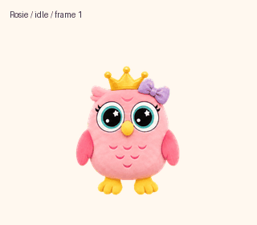

# Rosie

Rosie is an animated pink owl companion with large teal eyes, a purple bow, and a golden crown. Her plush appearance was created from four reference images using built-in image generation.

This repository contains the existing, approved artwork: nine animation states, sixteen look directions, and the original blinking idle loop.



## Install Rosie in the Codex desktop app

If Rosie already appears in **Settings > Pets**, select her and skip the installation steps below. A fresh local installation uses the PNG in this repository directly; no image generation or API key is needed.

### 1. Download the repository

Download and extract the public repository using **Code > Download ZIP**, or clone it with Git:

```sh
git clone https://github.com/djek195/rosie-pet.git
cd rosie-pet
```

### 2. Create a local pet folder

Create a new folder named `rosie` inside your Codex `pets` directory:

| Platform | Default folder |
| --- | --- |
| macOS | `~/.codex/pets/rosie/` |
| Windows | `%USERPROFILE%\.codex\pets\rosie\` |

If you set `CODEX_HOME`, use `<CODEX_HOME>/pets/rosie/` instead. If that folder already contains a pet, keep it and use another folder name for this installation.

Copy the repository's [spritesheet.png](spritesheet.png) into that folder. Create a text file named **pet.json** beside it with this exact content:

```json
{
  "displayName": "Rosie",
  "description": "A cheerful pink owl with sparkling teal eyes, a purple bow, and a golden crown.",
  "spriteVersionNumber": 2,
  "spritesheetPath": "spritesheet.png"
}
```

The resulting folder should contain:

```text
rosie/
├── pet.json
└── spritesheet.png
```

Keep `spriteVersionNumber` set to `2`: this PNG is a **1536 × 2288** v2 atlas. Use the original PNG to preserve transparency and frame alignment. The local `pet.json` format was verified against desktop version **26.928.21956**, build **12404**.

### 3. Select and show Rosie

1. Open **Settings > Pets** in the desktop app.
2. Select **Refresh**, then choose **Rosie**. If she is missing, restart the app and check the folder and JSON above.
3. Enter `/pet` in a chat, or choose **Show pet** from the command menu.

The selection and display controls are described in [OpenAI Docs: Pets](https://learn.chatgpt.com/docs/pets?surface=app#choose-and-wake-a-pet).

## Use Rosie

- Start a chat with the pencil button below Rosie; use the bell to open activity from your chats.
- Show the floating controls with **Option+Space** on macOS or **Windows+Alt+P** on Windows, unless you changed the shortcut.
- Adjust her size in **Settings > Pets > Customize > Pet size**.
- Hide her with `/pet`, **Hide pet**, or the pet's right-click menu.

Rosie's status follows your chats:

| Status | Meaning |
| --- | --- |
| Running | A chat is actively working. |
| Needs input | A chat needs your answer or approval. |
| Ready | A chat has finished and has unread activity. |
| Blocked | A chat failed or encountered an error. |

See [OpenAI Docs: floating controls and activity](https://learn.chatgpt.com/docs/pets?surface=app#show-or-hide-the-floating-controls) for details. Desktop pets are stored locally and do not automatically sync to ChatGPT web. This guide installs the desktop v2 asset; web upload requirements may differ.

## Preview playback versus the app

The GIFs demonstrate the artwork and frame order; they are not recordings of the desktop app. In the desktop build checked above, idle plays **six times slower** than these GIF previews: a **6.6-second** cycle instead of **1.1 seconds**. Cursor tracking selects one of sixteen static look directions, and interaction or status changes can interrupt an animation. The sprite sheet itself contains no frame-duration settings.

The current idle keeps its blink. The artwork and existing previews have not been changed to remove it. If the pet remains completely still, check your operating system's reduced-motion setting; see [OpenAI Docs: Reduce animation](https://learn.chatgpt.com/docs/pets?surface=app#reduce-animation).

## Repository files

- [spritesheet.png](spritesheet.png) — transparent v2 atlas, 1536 × 2288 pixels, with 192 × 208 cells in an 8 × 11 grid.
- [previews/](previews/) — individual state GIFs, a combined GIF and MP4, an idle/jump transition, look directions, and still frames.
- [source/](source/) — the original creation record.

## Previews

- [All animations — MP4](previews/all-states.mp4)
- [Idle with blinking](previews/idle.gif)
- [Look-direction sweep](previews/look-loop.gif)
- [Idle → jump → idle](previews/idle-jump-idle.gif)
- [All frames](previews/contact-sheet.png)
- [Labeled look directions](previews/look-directions.png)

## Validation and reference privacy

Only generated pet artwork, previews, and creation metadata are published. Original reference photos, reference collages, and source archives are excluded from this repository and its rewritten history.

If you cloned the repository before the reference cleanup, replace that clone with a fresh one before contributing. Pushing the old history could restore the removed files.

The final sprite sheet passed structural validation, the pet quality gate, independent look-direction review, and Pets upload validation. The original pet's stable ID and creation metadata are recorded in [creation-record.json](source/creation-record.json). That ID belongs to the original installation; a new local installation uses its own folder-based identity.
